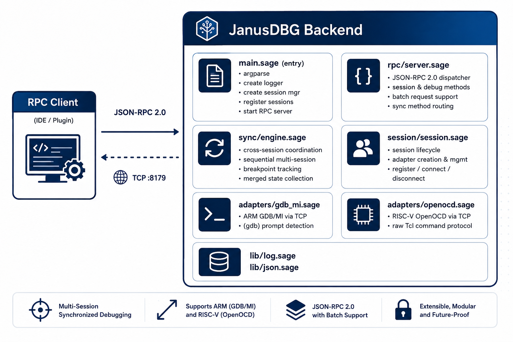
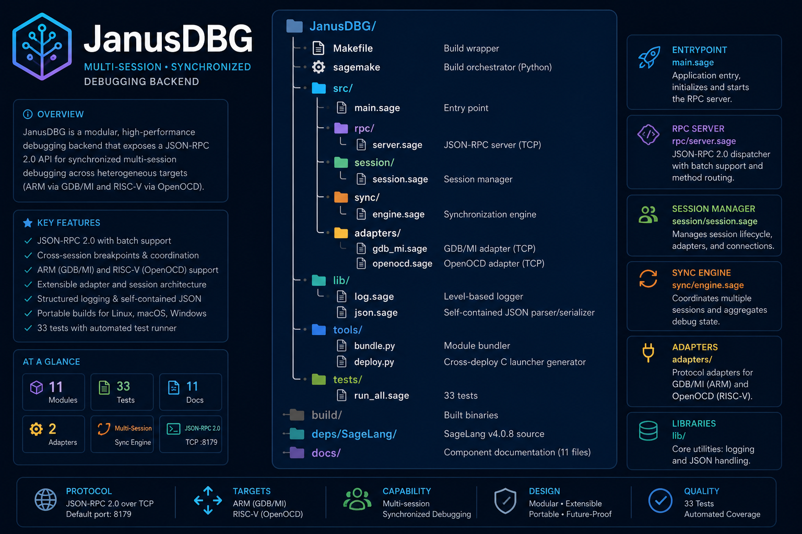

# JanusDBG

**Unified debugging backend for heterogeneous ARM Cortex-A + RISC-V SoCs.**

JanusDBG is a lightweight backend daemon that bridges JSON-RPC 2.0 requests to GDB/MI (ARM) and OpenOCD Tcl (RISC-V) debug sessions. Written in SageLang and deployed via JIT launcher for native module support (`tcp`, `sys`). Built with a two-layer deployment strategy using Sage's bytecode mode for maximum portability.

---

## Architecture



### Current Features (Implemented)

| Feature | Status | Description |
|---------|--------|-------------|
| **JSON-RPC 2.0 Server** | ✅ | TCP server on configurable port, single & batch requests |
| **Session Manager** | ✅ | Register ARM + RISC-V sessions, connect/disconnect lifecycle |
| **GDB/MI Adapter** | ✅ | TCP connection to GDB, send MI commands, (gdb) prompt parsing |
| **OpenOCD Adapter** | ✅ | TCP connection to OpenOCD Tcl server, send Tcl commands |
| **Error Handling** | ✅ | try/catch wraps all adapter ops, returns JSON-RPC error codes |
| **Sync Engine** | ✅ | Cross-session halt, resume, step, breakpoint, merged state |
| **Cross-Core Breakpoints** | ✅ | Set breakpoints on multiple sessions simultaneously |
| **Synchronized Step/Continue** | ✅ | Sequential multi-session step, halt, resume |
| **JIT Deployment** | ✅ | Architecture-independent shell launcher via `sage --jit` |
| **Test Suite** | ✅ | 33 tests covering all modules |

### Planned Features

| Feature | Status | Description |
|---------|--------|-------------|
| **VS Code Extension** | ✅ | Extension with debug adapter, build + install via sagemake |
| **Performance Timeline** | 📋 | Merged execution events from both cores |
| **Profiling Aggregator** | 📋 | Flame graphs from hardware counters |
| **Embedded REPL** | 📋 | SageLang REPL for custom trace scripts |

---

## Quick Start

### Prerequisites

- **SageLang** v4.0.8+ (included at `deps/SageLang/`)
- GDB (for ARM debugging) — `gdb-multiarch` recommended
- OpenOCD (for RISC-V JTAG) — built with RISC-V support

### Build

```bash
# Build native binary
make build

# Build for all 6 target architectures
make build-all
```

### Run

```bash
# Start the backend server (defaults: ARM@localhost:2331, RV@localhost:3333, RPC@:8179)
./build/janusdbgd

# With custom targets
./build/janusdbgd --arm-host 192.168.1.10:2331 --rv-host 192.168.1.11:3333 --verbose
```

### Test

```bash
make test
# or
./sagemake test
```

---

## RPC Protocol

Debug commands available over JSON-RPC 2.0:

```json
// Connect to a session
{"method": "connect", "params": {"session": "arm"}, "id": 1}
→ {"jsonrpc": "2.0", "result": "connected", "id": 1}

// Halt the target
{"method": "halt", "params": {"session": "arm"}, "id": 2}
→ {"jsonrpc": "2.0", "result": "*stopped,...", "id": 2}

// Set a breakpoint
{"method": "setBreakpoint", "params": {"session": "arm", "addr": "*0x8000"}, "id": 3}
→ {"jsonrpc": "2.0", "result": "^done,bkpt=...", "id": 3}
```

Full API reference: [RPC Server](docs/rpc-server.md)

---

## Project Structure



---

## Deployment

JanusDBG uses `sage --jit` for deployment — no C compilation needed. The deploy tool bundles all source into a single file and wraps it in an executable shell script:

1. `tools/bundle.py` inlines all module dependencies into `build/janusdbg_bundle.sage`
2. `tools/deploy.py` generates a self-contained shell launcher (`build/janusdbgd`) with the bundle embedded
3. Run `./build/janusdbgd` — it launches `sage --jit` on the bundle

**Prerequisite**: The target system must have the SageLang interpreter (`sage`) on `$PATH`.

See [Deployment](docs/deployment.md) and [Build System](docs/build-system.md) for details.

---

## Documentation

Component-level documentation is in `docs/`:

| Document | Contents |
|----------|----------|
| [Architecture](docs/architecture.md) | System design, module deps, cross-compilation strategy |
| [Entry Point](docs/main.md) | CLI args, main flow |
| [Logger](docs/lib-log.md) | Level-based logger API |
| [JSON Utilities](docs/lib-json.md) | Self-contained JSON parser/serializer |
| [Session Manager](docs/session-manager.md) | Session lifecycle, adapter creation |
| [RPC Server](docs/rpc-server.md) | JSON-RPC 2.0 dispatch, error handling, sync methods |
| [Sync Engine](docs/sync-engine.md) | Cross-session coordination, merged state |
| [GDB/MI Adapter](docs/adapter-gdb-mi.md) | ARM debug adapter, TCP protocol |
| [OpenOCD Adapter](docs/adapter-openocd.md) | RISC-V debug adapter, Tcl protocol |
| [Test Suite](docs/test-suite.md) | 21 test coverage map |
| [Build System](docs/build-system.md) | sagemake/Makefile targets, CI/CD |
| [Deployment](docs/deployment.md) | JIT launcher workflow, target-independence |

---

## License

MIT
