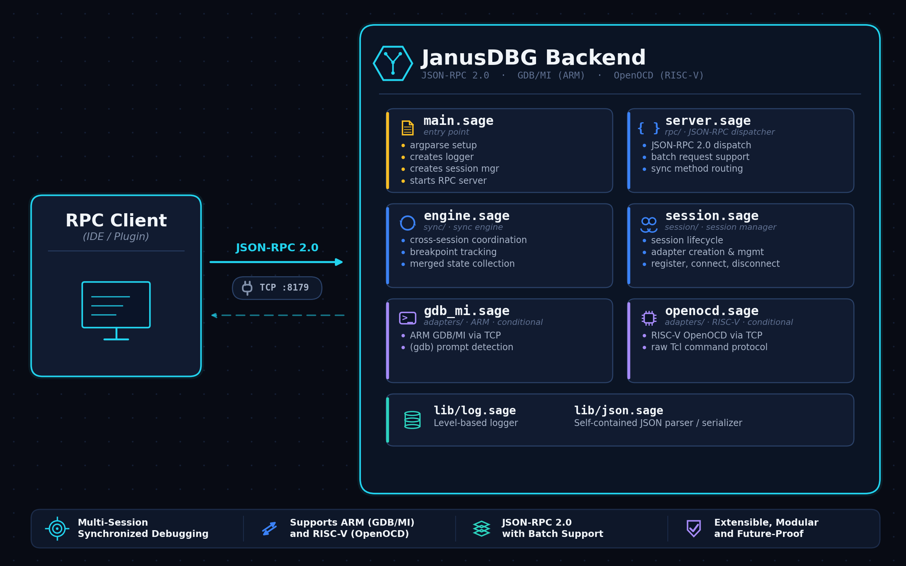
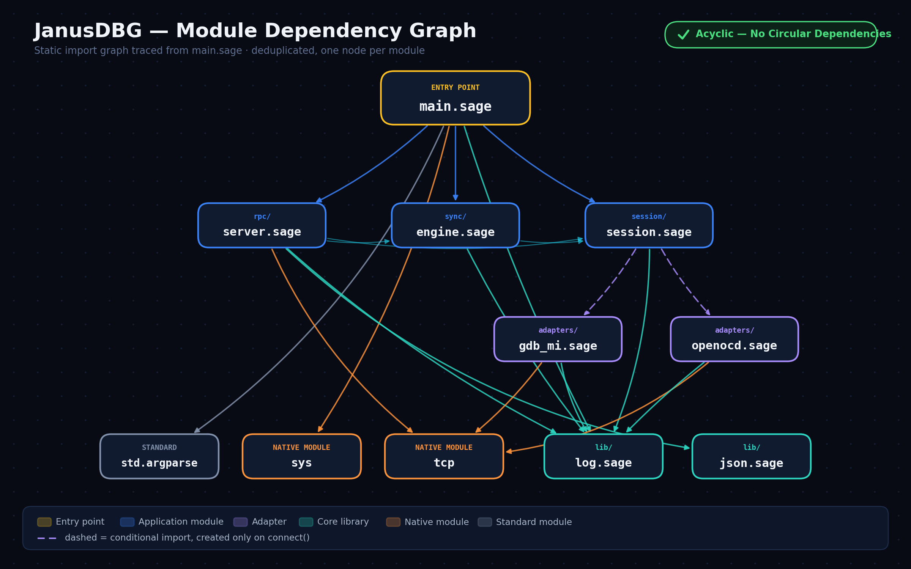
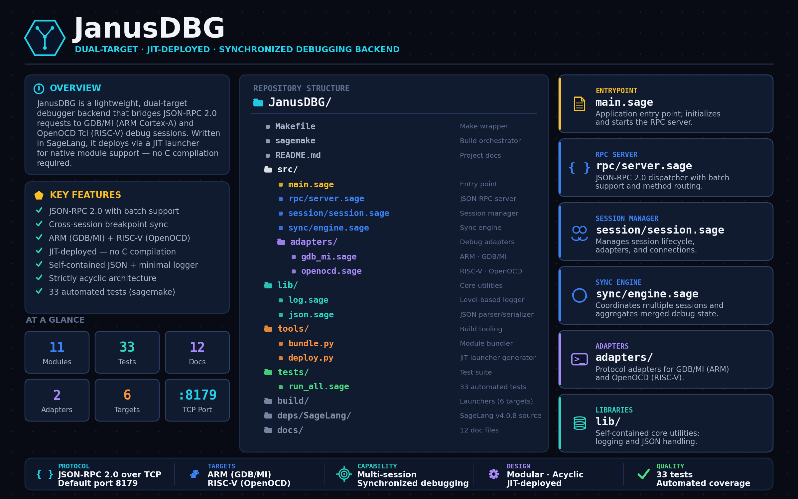

# JanusDBG Architecture

## Overview

JanusDBG is a lightweight, dual-target debugger backend that bridges JSON-RPC 2.0 requests to GDB/MI (ARM Cortex-A) and OpenOCD Tcl (RISC-V) debug sessions. It is written in SageLang and deployed via JIT launcher for native module support (`tcp`, `sys`). No C compilation is required.

## High-Level Design

## Module Dependency Graph

No circular dependencies. Each module imports only what it needs.

## Deployment Strategy

JanusDBG uses native module calls (`tcp`, `sys`) that cannot be compiled via SageLang's C/LLVM codegen backends. The solution is a **JIT-based launcher** (`tools/deploy.py`):

1. Bundle all source modules into a single `build/janusdbg_bundle.sage` via `tools/bundle.py`
2. Generate an executable shell script that embeds the bundle and launches via `sage --jit`
3. The launcher writes the bundle to a temp file and exec's the SageLang JIT interpreter

This approach is **architecture-independent** — the same launcher works on x86, ARM, RISC-V, or any platform with `bash` and the `sage` interpreter. No C compilation or cross-compilation is required.

**Prerequisite**: The target system must have the SageLang interpreter (`sage`) on `$PATH`.

## Target Architectures

| Target | C Compiler | Status |
|--------|-----------|--------|
| Target | Launcher | Notes |
|--------|----------|-------|
| x86 (32-bit) | `build/janusdbgd_x86` | Architecture-independent shell script |
| x86\_64 | `build/janusdbgd_x86_64` | Same script, different filename |
| ARM 32-bit | `build/janusdbgd_arm32` | Requires `sage` + `bash` on target |
| ARM 64-bit | `build/janusdbgd_aarch64` | Requires `sage` + `bash` on target |
| RISC-V 64-bit | `build/janusdbgd_rv64` | Requires `sage` + `bash` on target |
| RISC-V 32-bit | `build/janusdbgd_rv32` | Requires `sage` + `bash` on target |

## Build System

The project uses two layers of build orchestration:

- **`sagemake`** — a Python script that performs check, test, build, deploy, and install operations
- **`Makefile`** — a thin wrapper around `sagemake` for convenience (`make build`, `make test`, etc.)

## Repository Structure

## Design Constraints

1. **No `std.json`** — the JSON module is self-contained because `std.json` may not be available on all targets
2. **No `std.log`** — the logger is minimal and avoids indirect callbacks unsupported by backends
3. **No `dict.get()`** — SageLang v4.0.8 dicts lack `.get()`; use `dict_has()` + direct index
4. **`continue` is reserved** — renamed to `cont` in `gdb_mi.sage`
5. **`from ... import` only** — all imports use explicit `from <module> import <name>` form for backend compatibility
6. **No circular imports** — the dependency graph is strictly acyclic
7. **JIT deployment** — `sage --jit` is required for native module calls (`tcp`, `sys`); C/LLVM backends cannot resolve these at compile time
8. **Adapter types** — sessions require explicit `adapter_type` ("gdb_mi" or "openocd") for adapter selection on connect
